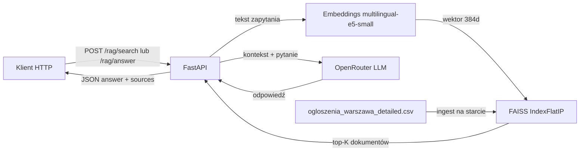

# Adresowo RAG API

REST API w FastAPI do wyszukiwania semantycznego i odpowiedzi RAG nad ogłoszeniami sprzedaży mieszkań z Warszawy (zbiór Adresowo).

## Architektura



## Stack technologiczny

- **FastAPI** + **Pydantic v2** — REST API i walidacja
- **sentence-transformers** (`intfloat/multilingual-e5-small`) — lokalne embeddingi po polsku
- **FAISS** — baza wektorowa z persystencją na dysku
- **OpenRouter** — generowanie odpowiedzi w `/rag/answer` (model `google/gemma-4-31b-it:free`)
- **Docker** — konteneryzacja aplikacji

## Wymagania

- Python 3.11+
- Klucz API OpenRouter (tylko dla endpointu `/rag/answer`)

## Konfiguracja

Skopiuj plik `.env.example` do `.env` i uzupełnij zmienne:

```bash
cp .env.example .env
```

| Zmienna | Opis | Domyślnie |
|---------|------|-----------|
| `OPENROUTER_API_KEY` | Klucz API OpenRouter | — |
| `OPENROUTER_MODEL` | Model LLM | `google/gemma-4-31b-it:free` (darmowy) |
| `OPENROUTER_BASE_URL` | URL API | `https://openrouter.ai/api/v1` |

Domyślny model `google/gemma-4-31b-it:free` jest bezpłatny na OpenRouter. Płatne modele (np. `openai/gpt-4o-mini`) wymagają kredytów na [openrouter.ai/settings/credits](https://openrouter.ai/settings/credits).

| `EMBED_MODEL` | Model embeddingów | `intfloat/multilingual-e5-small` |
| `DATA_PATH` | Ścieżka do CSV | `data/ogloszenia_warszawa_detailed.csv` |
| `INDEX_DIR` | Katalog indeksu FAISS | `index` |
| `DEFAULT_TOP_K` | Domyślna liczba wyników | `5` |
| `MAX_TOP_K` | Maksymalna liczba wyników | `20` |

## Uruchomienie lokalne

```bash
python -m venv .venv
source .venv/bin/activate
pip install -r requirements.txt
uvicorn app.main:app --reload --host 0.0.0.0 --port 8000
```

Przy pierwszym uruchomieniu aplikacja:
1. pobierze model embeddingów (~120 MB),
2. zbuduje indeks FAISS z pliku CSV (~1–2 min na CPU),
3. zapisze indeks w katalogu `index/`.

Kolejne uruchomienia wczytują indeks z dysku.

Dokumentacja interaktywna: [http://localhost:8000/docs](http://localhost:8000/docs)

## Uruchomienie w Dockerze

Pierwsze uruchomienie kontenera może potrwać 1–2 minuty (budowa indeksu FAISS). Model embeddingów jest pobierany przy starcie, jeśli nie ma go w cache.

### Budowanie obrazu

```bash
docker build -t adresowo-rag .
```

Budowa trwa kilka minut (instalacja PyTorch CPU + zależności). Nie używaj `docker compose` — w projekcie nie ma pliku `docker-compose.yml`.

### Uruchomienie kontenera

```bash
docker run --rm -p 8000:8000 \
  -e OPENROUTER_API_KEY=sk-or-v1-twoj-klucz \
  -e OPENROUTER_MODEL=google/gemma-4-31b-it:free \
  -v "$(pwd)/index:/app/index" \
  adresowo-rag
```

Volume `index/` pozwala zachować zbudowany indeks między restartami kontenera.

## Endpointy API

### `GET /health`

Sprawdza stan aplikacji.

```bash
curl http://localhost:8000/health
```

### `POST /rag/search`

Wyszukiwanie semantyczne wśród ogłoszeń. **Zapytanie przesyłane jest jako zwykły tekst** (`Content-Type: text/plain`), a API zwraca najbardziej podobne transkrypcje.

```bash
curl -X POST "http://localhost:8000/rag/search?top_k=5&district=Mokotów&price_max=800000" \
  -H "Content-Type: text/plain" \
  -d 'dwupokojowe na Mokotowie do 800 tysięcy'
```

### `POST /rag/answer`

Pytanie do bazy ogłoszeń z odpowiedzią generowaną przez LLM. **Pytanie przesyłane jest jako zwykły tekst** (`Content-Type: text/plain`).

```bash
curl -X POST "http://localhost:8000/rag/answer?top_k=5&temperature=0.2" \
  -H "Content-Type: text/plain" \
  -d 'jakie mieszkania blisko metra mają balkon?'
```

### `POST /admin/reindex`

Przebudowanie indeksu (zwraca `202 Accepted`).

```bash
curl -X POST http://localhost:8000/admin/reindex \
  -H "Content-Type: application/json" \
  -d '{"force": true}'
```

### `GET /tasks/{task_id}`

Status zadania reindeksacji.

```bash
curl http://localhost:8000/tasks/<task_id>
```

## Statusy HTTP

| Kod | Znaczenie | Kiedy |
|-----|-----------|-------|
| 200 | OK | Poprawne pobranie danych |
| 202 | Accepted | Zadanie przyjęte do przetwarzania (`/admin/reindex`) |
| 400 | Bad Request | Brak lub niepoprawny plik danych |
| 404 | Not Found | Brak zadania o podanym ID |
| 422 | Unprocessable Entity | Błędne dane wejściowe (walidacja Pydantic) |
| 500 | Internal Server Error | Błąd przetwarzania po stronie serwera |
| 502 | Bad Gateway | Błąd komunikacji z OpenRouter |
| 503 | Service Unavailable | Brak klucza OpenRouter dla `/rag/answer` |

## Testy

```bash
pytest -v
```

Testy obejmują: health check, wyszukiwanie semantyczne, odpowiedź RAG (z mockiem LLM) oraz walidację Pydantic.

## Przykłady ewaluacji jakościowej

| Zapytanie | Oczekiwane zachowanie |
|-----------|----------------------|
| „kawalerka Białołęka” | Wyniki z dzielnicy Białołęka |
| „mieszkanie z klimatyzacją” | Semantyczne dopasowanie do opisów z klimatyzacją |
| „3 pokoje Mokotów do 800 tys.” | Filtrowanie po pokojach, dzielnicy i cenie |
| „mieszkanie blisko metra” | Odpowiedź RAG z cytowaniem źródeł [1], [2] |

## Ograniczenia

- Indeks budowany w pamięci przy pierwszym starcie — wymaga czasu i CPU.
- `/rag/answer` wymaga aktywnego klucza OpenRouter i połączenia z internetem.
- Filtry strukturalne (cena, pokoje) działają na metadanych; wyszukiwanie semantyczne na embeddingach.
- Zadania reindeksacji przechowywane są w pamięci procesu (nie przetrwają restartu).

## Struktura projektu

```
.
├── app/
│   ├── main.py
│   ├── config.py
│   ├── schemas.py
│   ├── deps.py
│   ├── errors.py
│   ├── routers/
│   └── services/
├── data/
│   └── ogloszenia_warszawa_detailed.csv
├── index/
├── tests/
├── Dockerfile
├── .dockerignore
├── requirements.txt
└── README.md
```
